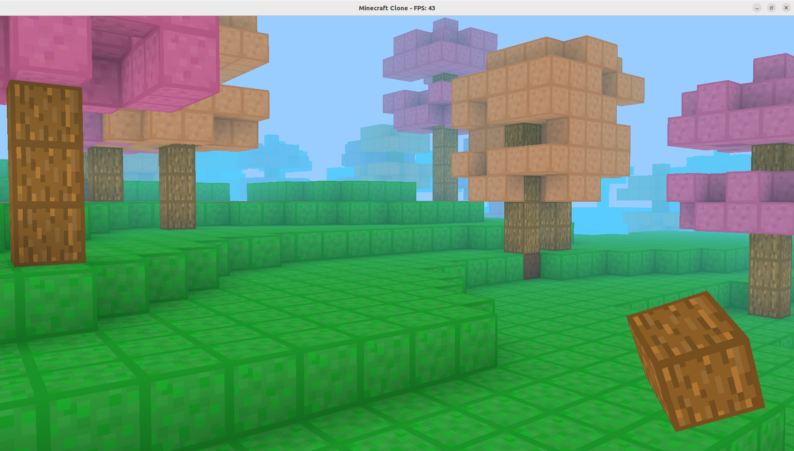

# MinecraftClone
A simple voxel-based world written in C++ using OpenGL, inspired by Minecraft.
It features real-time terrain generation, chunk loading, textured blocks, and a basic HUD.

## Screenshots

### Building with blocks


### Postprocess effect underwater


### Seeded terrain generation


### Digging a hole


---

## Features

- Procedural terrain generation using [FastNoiseLite](https://github.com/Auburn/FastNoiseLite)
- Infinite chunk system with dynamic loading/unloading
- Block interaction: placement and removal
- Texture atlas for efficient rendering
- Custom GLSL shaders
- Simple HUD with selected block preview
- Built with CMake and modern C++17

---

## Dependencies

Make sure you have these installed:

- OpenGL 3.3+
- GLFW
- GLAD
- stb_image
- FastNoiseLite (included)

---

## Build Instructions

### Linux / Windows (via WSL, MSYS, or similar)

```bash
git clone https://github.com/QadriC/MinecraftClone.git
cd MinecraftClone
mkdir build && cd build
cmake ..
make
./MinecraftClone
```
If you're using Visual Studio Code, launch using the .vscode/launch.json.

## Controls

| Key           | Action                |
| ------------- | --------------------- |
| `W A S D`     | Move player           |
| `Space`       | Fly up                |
| `Left Ctrl`   | Fly down              |
| `Shift`       | Sprint                |
| `Mouse`       | Look around           |
| `Arrows`      | Look around (VM Users)|
| `Left Click`  | Break block           |
| `Right Click` | Place block           |
| `1 - 8`       | Change selected block |
| `TAB`         | Toggle mesh view      |

## Project Structure

```
├── include/       # Headers and external libraries
├── shaders/       # GLSL shader files
├── src/           # Source code
├── textures/      # Texture atlas and images
├── .vscode/       # VSCode config (optional)
└── CMakeLists.txt # Build configuration
```

## Notes

If you are using a virtual machine, there might be problems recieving mouse inputs for camera rotation.
Consider disabling mouse integration or use the key arrows instead.
